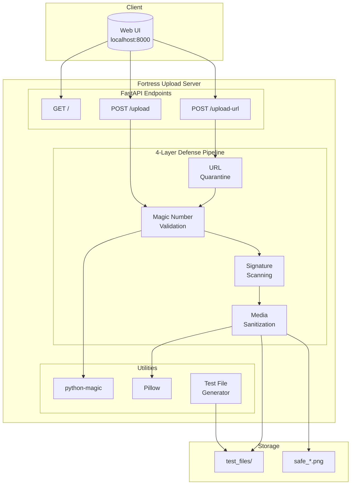
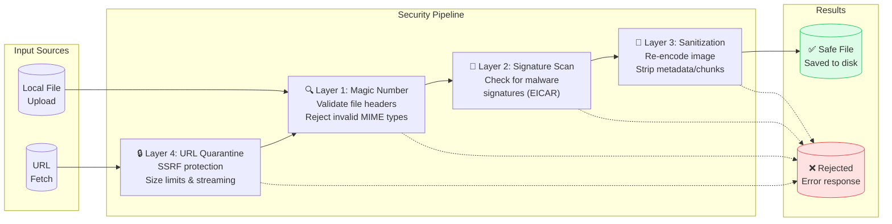

# Fortress Upload 🛡️

A defense-in-depth FastAPI demonstration for securely handling user media uploads. This project protects backend servers from common upload vulnerabilities including disguised malware, polyglot files, and metadata injection (RCE vectors).


## Overview

When a web application accepts file uploads, it exposes itself to severe risks if files aren't heavily validated and sanitized. Attackers frequently bypass simple `.extension` checks. This project implements a **4-Layer Defense Pipeline**:

1. **Magic Number Validation** — Verifies actual file headers (bytes) rather than trusting user-provided extension or MIME type
2. **Signature Scanning** — Scans incoming byte stream for known malware signatures (simulating ClamAV)
3. **Media Sanitization** — Re-encodes images using Pillow, stripping EXIF data, hidden chunks, and polyglot payloads
4. **URL Quarantine** — Safely fetches files from URLs with SSRF protection, timeout limits, and streaming to prevent zip bombs

## Architecture



## Defense Pipeline Flow



## Features

- **Real-time File Validation** — Rejects non-media files instantly using `python-magic`
- **URL Quarantine** — Safely fetches files from URLs with SSRF protection, timeout limits, and streaming to prevent zip bombs
- **Chunked Upload Processing** — Reads files in 8KB chunks to prevent memory exhaustion
- **Automated Test File Generation** — Creates safe, EICAR-simulated, and polyglot test files on startup
- **Polyglot Neutralization** — Strips hidden PHP web-shells injected into PNG chunks
- **Zero-Disk-Write Validation** — All scans and sanitization happen in memory (`io.BytesIO`) before writing to disk

## Prerequisites

- Python 3.13+
- `libmagic` (required for file header validation)
  - **Ubuntu/Debian:** `sudo apt-get install libmagic1`
  - **macOS:** `brew install libmagic`
  - **Windows:** Use `pip install python-magic-bin`

## Installation

```bash
# Clone the repository
git clone https://github.com/yourusername/fortress-upload.git
cd fortress-upload

# Create virtual environment
python -m venv venv
source venv/bin/activate  # Windows: venv\Scripts\activate

# Install dependencies
pip install fastapi uvicorn python-multipart Pillow python-magic
# Windows: pip install python-magic-bin instead of python-magic
```

## Running the Application

```bash
uvicorn main:app --host 0.0.0.0 --port 8000 --reload
```

Navigate to `http://localhost:8000` to access the upload interface with two modes:

- **Upload Local File** — Drag & drop or select a file from your device
- **Fetch from URL** — Enter a URL to download and scan an image remotely

## Testing the Defenses

When the server starts, it automatically generates a `test_files/` directory with three files. Upload each through the web UI to observe the defense pipeline:

| File | Expected Result | Why |
|------|-----------------|-----|
| `clean_image.png` | ✅ Success | Standard PNG format, no malicious signatures, clean metadata |
| `eicar_simulated_virus.png` | ❌ Blocked (406) | Contains EICAR test string, blocked by Layer 2 |
| `polyglot_webshell.png` | ⚠️ Success (modified) | Hidden PHP in PNG tEXt chunk destroyed by Layer 3 |

## Project Structure

```
fortress-upload/
├── main.py                # Core FastAPI app and security pipeline
├── README.md              # This file
├── test_files/            # Auto-generated test files
│   ├── clean_image.png
│   ├── eicar_simulated_virus.png
│   └── polyglot_webshell.png
└── safe_*.png             # Sanitized output files
```

## Disclaimer

This is an educational project demonstrating defensive programming techniques. The "malware" is strictly simulated (EICAR strings and harmless text) and safe to run locally. Do not use the simulated scanner in production — replace `simulate_clamav_scan` with actual ClamAV bindings.